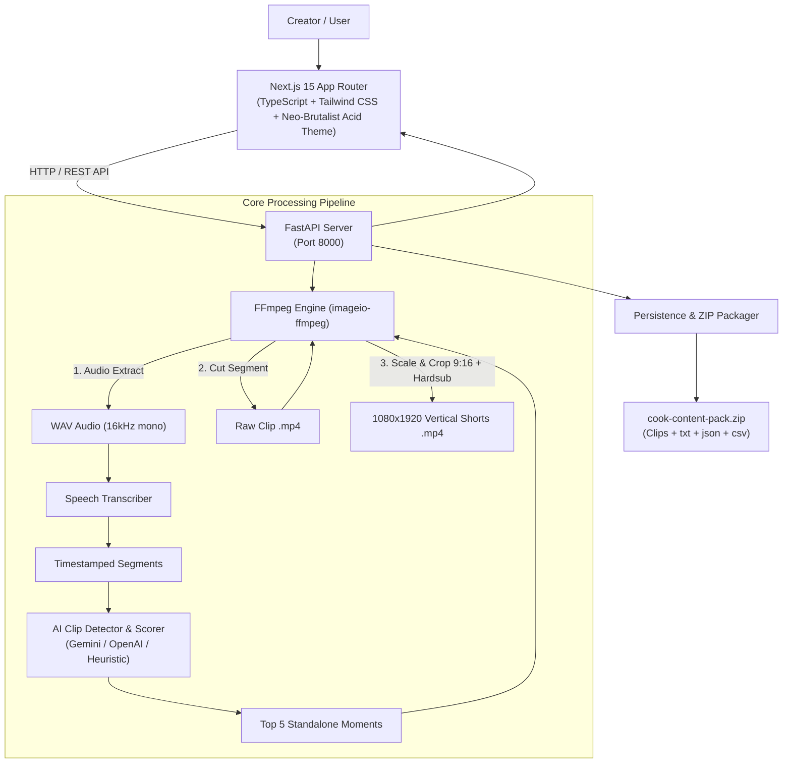

# COOK — ONE VIDEO. LET IT COOK.

> **A bold, high-contrast Neo-Brutalist AI creator workflow tool that turns one long-form video into a complete week of ready-to-post short-form content.**

[](https://github.com)
[](https://nextjs.org/)
[](https://fastapi.tiangolo.com/)
[](https://ffmpeg.org/)

---

## ⚡ Overview

Most creators burn out because chopping clips, formatting 9:16 aspect ratios, burning subtitles, and drafting hooks/captions manually takes 6+ hours per video.

**COOK** automates the entire transformation pipeline:
1. **Upload Video** (MP4, MOV, WEBM)
2. **Audio Extraction** via FFmpeg
3. **Timestamped Speech Transcription**
4. **AI Clip Detection** (Curiosity, Hook Strength, Retention signal analysis)
5. **Shorts Cutting & 9:16 Vertical Cropping** (1080×1920)
6. **Hard-Burned High-Contrast Subtitles**
7. **Multi-Platform Hooks, Captions, Titles & Hashtags** (Instagram, Shorts, TikTok, LinkedIn)
8. **AI Content Score Calculation** (0–100 weighted signal)
9. **Weekly Publishing Schedule Generation**
10. **Structured Content Pack ZIP Export**

---

## 🏛️ System Architecture



---

## 🎨 Design System: "Acid" Neo-Brutalism

- **Background**: `#F8F4E8` (warm editorial paper)
- **Ink Primary / Borders**: `#09090B` (solid 2px to 4px borders)
- **Signature Highlight**: `#D2E823` (Acid yellow-green)
- **Typography**: `Dela Gothic One` (display headings) & `Space Grotesk` (body)
- **Shadows**: Hard solid offset box shadows (`4px 4px 0px #09090B`, `8px 8px 0px #09090B`), strictly 0 blur.
- **Micro-Interactions**: Tactile button press animations (`translate(2px, 2px)`, shadow removal), continuous marquee loop (20s), and custom 32px difference circle cursor.
- **Global Noise Texture**: 3% SVG fractal noise overlay.

---

## 🚀 Quickstart & Installation

### 1. Prerequisites
- **Node.js**: v18+ (tested on Node v24)
- **Python**: 3.10+ (tested on Python 3.13)
- **FFmpeg**: Automatically bundled via Python `imageio-ffmpeg`

### 2. Backend Setup
```bash
cd backend
python -m pip install -r requirements.txt
python -m uvicorn app.main:app --port 8000 --reload
```
The FastAPI backend will start at `http://localhost:8000`.

### 3. Frontend Setup
```bash
cd frontend
npm install
npm run dev
```
The Next.js creator application will start at `http://localhost:3000`.

---

## 📡 API Reference

| Endpoint | Method | Description |
| :--- | :--- | :--- |
| `/api/upload` | `POST` | Upload long-form video (MP4/MOV/WEBM) with validation |
| `/api/process/{video_id}` | `POST` | Launch background processing pipeline |
| `/api/process/{video_id}/status` | `GET` | Real-time status and progress polling (0–100%) |
| `/api/videos` | `GET` | List all uploaded videos |
| `/api/videos/{video_id}` | `GET` | Get video details, clips, transcripts, and schedules |
| `/api/clips/{video_id}` | `GET` | Retrieve generated clips for a video |
| `/api/clips/item/{clip_id}` | `GET` | Retrieve single clip detail with metadata |
| `/api/clips/item/{clip_id}` | `PUT` | Update clip metadata (selected hook, caption, titles, tags) |
| `/api/clips/item/{clip_id}/regenerate` | `POST` | Re-trim video segment with new timestamps using FFmpeg |
| `/api/clips/item/{clip_id}/download` | `GET` | Direct stream download of 9:16 vertical MP4 |
| `/api/export/{video_id}` | `POST` | Generate and download structured content pack ZIP |
| `/api/schedule/{video_id}` | `GET` | Retrieve AI weekly publishing calendar |
| `/api/demo/setup` | `POST` | Initialize 1-click sample video demo |

---

## 📦 Content Pack Structure (`.zip`)

When clicking **EXPORT CONTENT PACK**, COOK generates:
```text
cook-content-pack/
├── clips/
│   ├── clip-01.mp4  (1080x1920 9:16 Vertical)
│   ├── clip-02.mp4
│   ├── clip-03.mp4
│   ├── clip-04.mp4
│   └── clip-05.mp4
├── captions.txt     (Platform-tailored captions)
├── titles.txt       (High CTR title variations)
├── hooks.txt        (3 hooks per clip)
├── hashtags.txt     (Optimized hashtags)
├── content-plan.json(Complete metadata dump)
└── schedule.csv     (Weekly calendar)
```

---

## 🧑‍🍳 Brand Philosophy

**ONE VIDEO. LET IT COOK.**  
Stop editing manually. Drop a video. COOK finds the gold.
